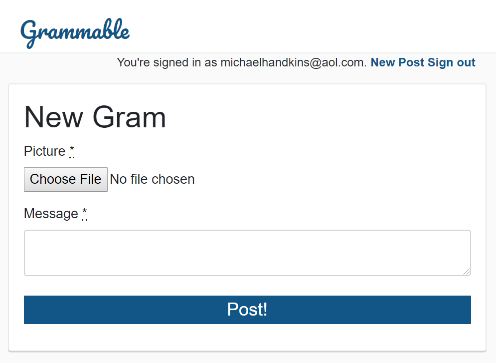
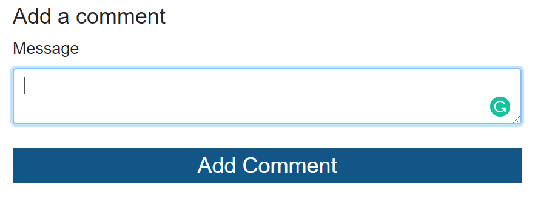

Grammable
=========

An Instagram clone that was built using industry-standard, test-driven development following numerous red/green/refactor cycles.

Technologies Used
-----------------

  * Ruby, v. 2.5.3
  * Rails
  * RSpec
  * FactoryBot
  * Devise
  * HTML5/CSS3

Interface
---------

Once registered as a user of Grammable, users may post "grams" (images with captions) via a "New Post."

Any registered user may then view grams and "add a comment."

Grammable is currently deployed at https://grammable-handkins.herokuapp.com/

